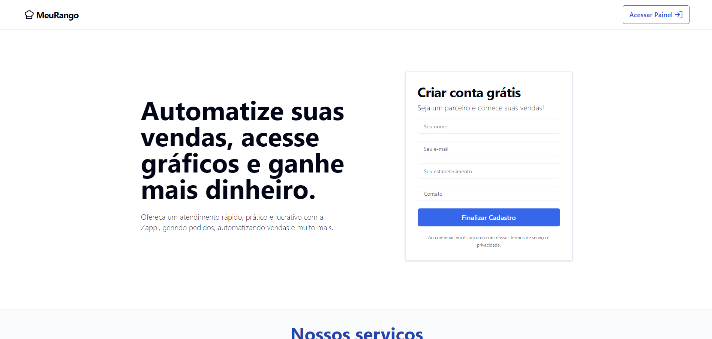
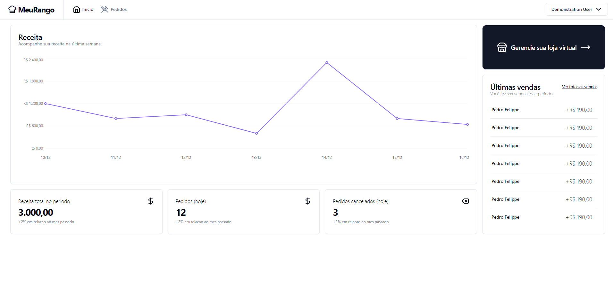
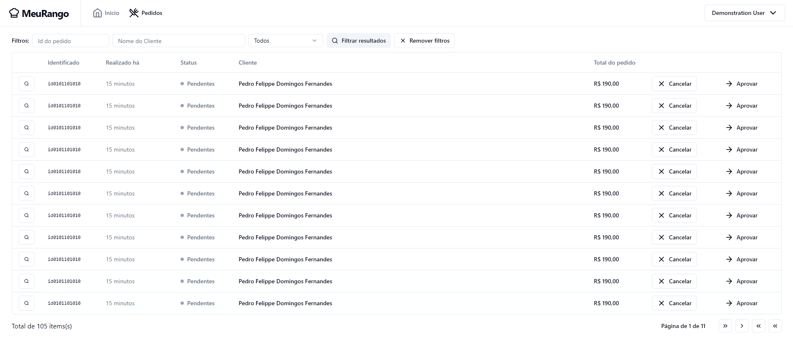

# Meu Rango

Meu Rango is an advanced restaurant order management system with AI integration, designed to streamline operations and enhance customer experience. Built with modern web technologies, it offers a comprehensive solution for restaurants looking to digitize their ordering process and gain valuable insights into their business.

## Features

- 🍽️ Digital Menu Management
- 📊 Sales Analytics and Reporting
- 🤖 AI-Powered Recommendations
- 🔐 Secure Authentication with Firebase
- 📱 Responsive Design for All Devices
- 🌐 Multilingual Support (English and Portuguese)

## Technology Stack

<p align="center">
  
</p>

- **Frontend**: React with Next.js
- **Language**: TypeScript
- **Styling**: Tailwind CSS
- **Backend & Authentication**: Firebase
- **State Management**: React Context API
- **Internationalization**: react-i18next
- **Charts**: Recharts

## Screenshots

<details>
<summary>View Screenshots</summary>

### Landing Page



### Login


### Dashboard



### Orders Management



</details>

## Getting Started

1. Clone the repository

   ```
   git clone https://github.com/your-username/meu-rango.git
   ```

2. Install dependencies

   ```
   cd meu-rango
   npm install
   ```

3. Set up environment variables

   - Create a `.env.local` file in the root directory
   - Add your Firebase configuration:
     ```
     NEXT_PUBLIC_FIREBASE_API_KEY=your_api_key
     NEXT_PUBLIC_FIREBASE_AUTH_DOMAIN=your_auth_domain
     NEXT_PUBLIC_FIREBASE_PROJECT_ID=your_project_id
     ...
     ```

4. Run the development server

   ```
   npm run dev
   ```

5. Open [http://localhost:3000](http://localhost:3000) in your browser

## Contributing

Contributions are welcome! Please feel free to submit a Pull Request.

1. Fork the project
2. Create your feature branch (`git checkout -b feature/AmazingFeature`)
3. Commit your changes (`git commit -m 'Add some AmazingFeature'`)
4. Push to the branch (`git push origin feature/AmazingFeature`)
5. Open a Pull Request

## License

This project is licensed under the MIT License - see the [LICENSE](LICENSE) file for details.

## Acknowledgments

- [React](https://reactjs.org/)
- [Next.js](https://nextjs.org/)
- [Tailwind CSS](https://tailwindcss.com/)
- [Firebase](https://firebase.google.com/)
- [react-i18next](https://react.i18next.com/)
- [Recharts](https://recharts.org/)
